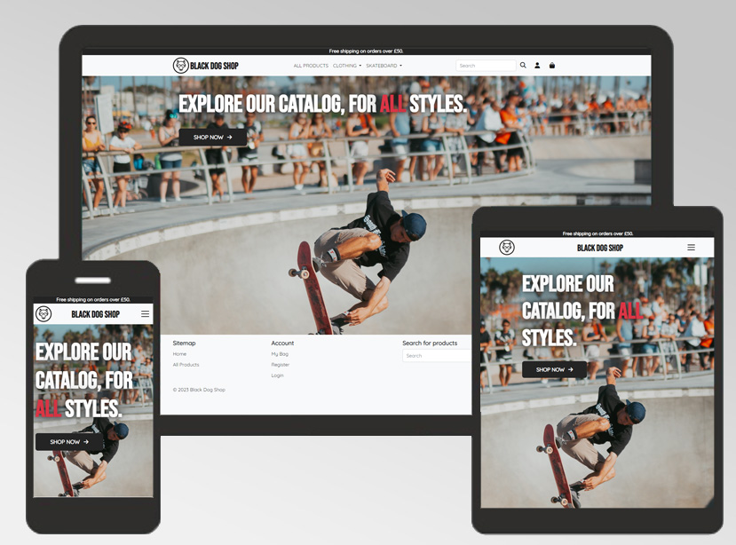
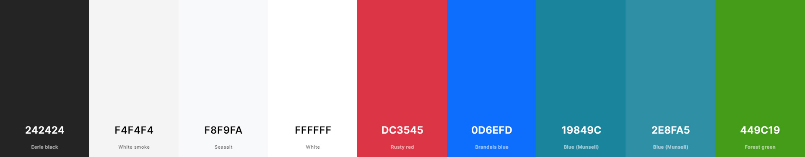
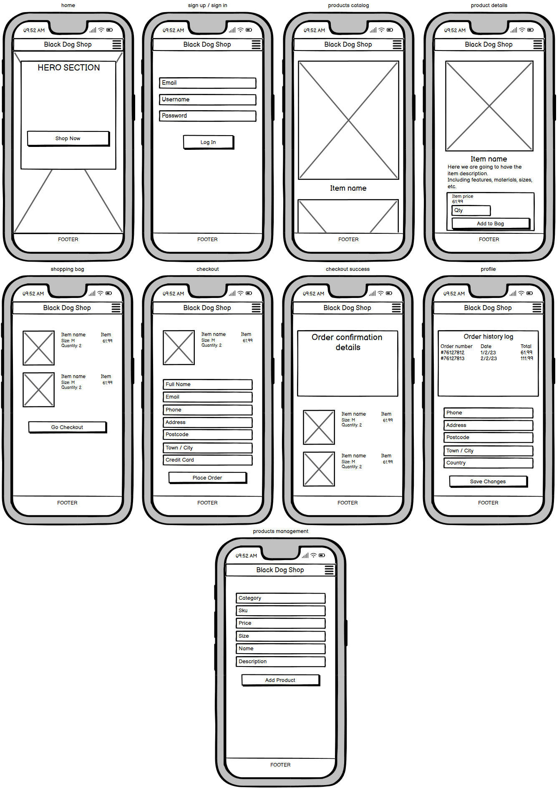
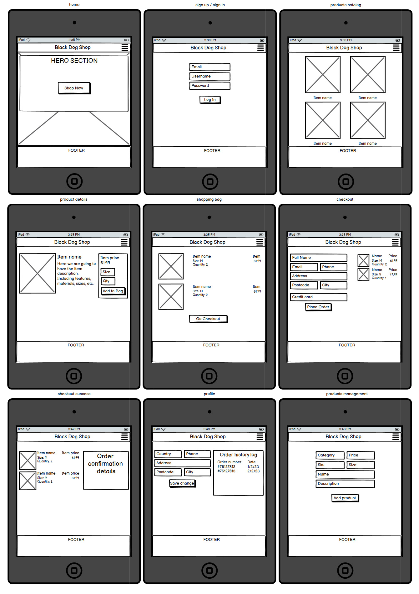
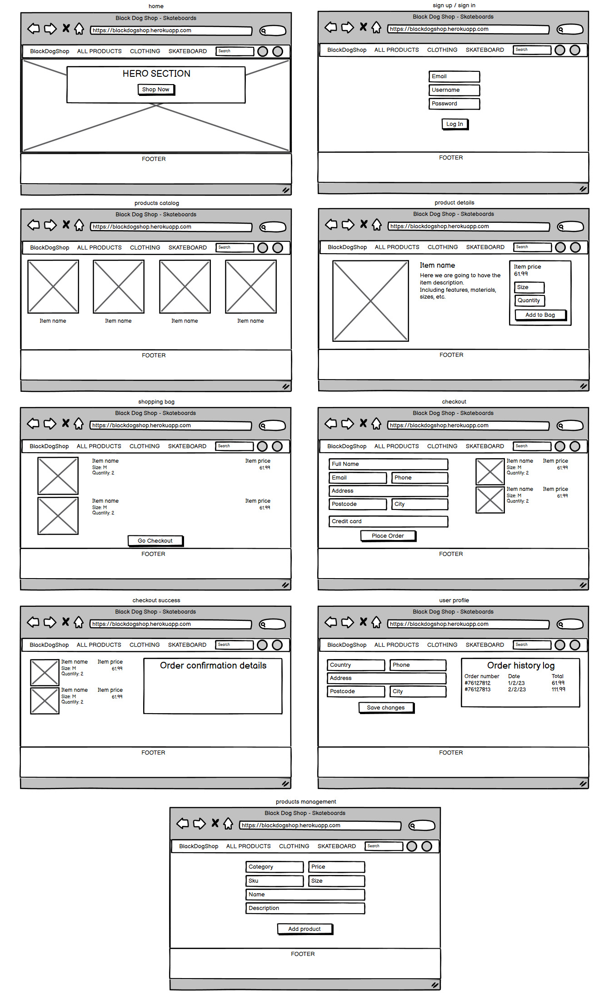
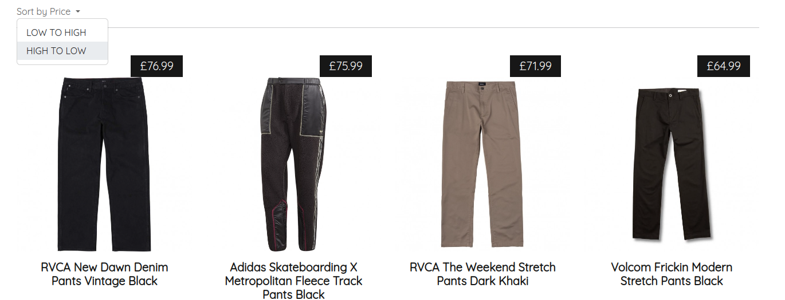
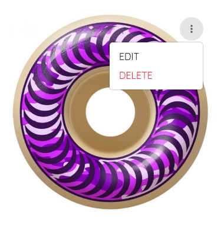
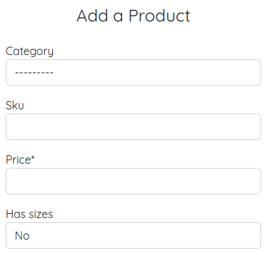
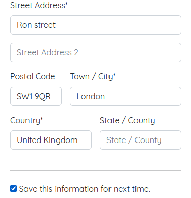
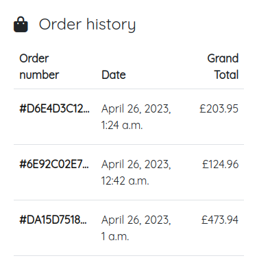

# Black Dog Shop: Skateboards and Clothing eCommerce


## 1. Description
Black Dog Shop is an interactive eCommerce website that allows users to safely purchase skateboards accesories and clothing products using Stripe payments. It does not require authentication for purchases even though you can enjoy more features as a registered user such as having a personalized profile to save your delivery details and check your order history log. There's three possible escenarios for the usage of this App:

- Anonymous Users: Allowed to place orders without needing to register.
- Registered Users: Same as Anonymous users but with the extra feature of having a profile for reviewing their order history and saving their details for future orders.
- Admin Users: Can manage store from an admin panel and also from the same website, allowing them to edit, add or delete products from a more friendly UI.

## 2. Live project
See live project [here](https://blackdogshop.herokuapp.com).

## 3. UX
### Design
The design is minimalist and makes use of very little colours, only where needed for highlighting text or features / possible actions.

#### **Colors**
Below you can find all the colours that I've used for this design:


#### **Fonts**
The entire website uses [Quicksand](https://fonts.google.com/specimen/Quicksand), with only two exceptions which are Navigation bar Logo and Hero Section (Home) that uses [Bebas-Neue](https://fonts.google.com/specimen/Bebas+Neue). Both of these fonts can be found on Google Fonts.

#### **Icons**
All the icons I've used can be found on [FontAwesome](https://fontawesome.com/).

#### **SVG files**
I've used two SVG files in this project, both found in the Navigation bar for the Logo and also for Mobile Menu (visible only on small screens). These are free SVG files coming from [Icons8](https://icons8.com)

#### **Imagery**
All the product images were downloaded from [BlackSheepStore](https://blacksheepstore.co.uk/). On the other hand, Hero Section (Home) image was downloaded from [Unsplash](https://unsplash.com)

### Wireframes
#### **Mobile view**


#### **Tablet view**


#### **Desktop view**


### User stories
Below you can find the user stories that I was able to cover in this project during its development.

#### **First time users**
As a first time user I would like to:
- Understand the website and its features at first glance.
- Have a search bar where I can easily search for products.
- Have accessible and responsive, friendly UI.
- Quick and easy way of checking out securely.

#### **Returning users**
As a returning user I would like to:
- System for tracking my orders such as an order history log.
- Be able to save my delivery information for future orders.

#### **Business owners**
As an owner I would like to have:
- System for managing products: adding, editing or deleting them.
- System for selling products: should be reliable, easy to use and secure.

## 4. Site Structure
Website/App consists of several pages, one of them is only accessible by registered users (Profile) and another one that is only accessible by Admin users (Products management: Add, Edit and Delete products).
- Home (*index.html*)
- Products catalog and Product details (*products.html*, product-details.html)
- Products management (*add-product.html*, *edit-product.html*)
- Checkout system (*checkout.html*, *checkout_success.html*)
- User's Profile (*profile.html*)
- Shopping bag (*shopping-bag.html*)
- Account Authentication pages (all of them come from all-auth library but have been edited for matching the style of the site, such as Sign up, Sign in, Sign out, Password reset, etc)

## 5. Features
### Current notable features
#### **Responsible Navbar with search bar**


#### **Responsible Footer with search bar**


#### **Product catalog allowing to filter by category or price, or both at the same time**


#### **Shopping bag displaying how many items there is currently in it**


#### **Shopping bag can be updated from its page**


#### **Business owners can add, edit or delete products, these last two are accessible from product details page**



#### **Registered users can save their information for future orders**


#### **Registered users can view their order history**


### Future features
I've planned to implement a Blog for bringing more dynamic content to the website rather than just a simple eCommerce website. Would also like to implement a 'Sales' section with discounted products.

## 6. Technologies used

### Languages
- HTML5
- CSS3
- JavaScript
- Python 3.10
- Jinja templating
- Git

### Frameworks/Libraries
- Bootstrap 5.2
- jQuery
- Django

### Extra packages
- Python decouple (for retrieving secret keys in local environment)
- Django countries (for retrieving a list of all available countries following ISO 3166-1, *important for Stripe)
- Django crispy forms
- Django storages
- Pillow (for image processing purposes)
- Boto3
- GUnicorn
- Psycopg2

### DBMS
- SQLite3 (local environment)
- ElephantSQL (online DB)

### Platforms
- Stripe (for managing payments)
- AWS (for hosting static files and product images)
- Heroku (for production hosting)

### Software
- PyCharm (main IDE for development)
- Visual Studio Code (backup IDE, mostly for *.css and *.md files)
- Adobe Photoshop CC (editing images)
- Balsamiq (wireframes)

## 7. Database Structure
This project is using Relational Database, commonly known as SQL. I've used SQLite3 for local development (included in Django) and ElephantSQL (based on PostgreSQL) for deploying the website online.

### Database Schema
In order to avoid making this section very large, I will mention the core tables that I'm using for storing my data in the DB, followed by an example:

- Users (automatically created by All-Auth upon registration)
```
    id: "12"
    password: "sha256-encryption"
    last_login: "2023-04-25 23:10:11 +0000"
    is_superuser: "false"
    username: "john"
    first_name: "john"
    last_name: "bonham"
    email: "john.bonham@gmail.com"
    is_staff: "false"
    is_active: "true"
    date_joined: "2023-04-25 23:03:11 +0000"
```

- Categories
```
    id: "1"
    name: "t_shirts"
    display_name: "T-Shirts"
```

- Products
```
    id: "1"
    sku: "bds013370001"
    name: "Volcom Caden Plaid Long Sleeve Shirt Khaki"
    description: "100% Cotton Modern Fit with Volcom Logo Buttons and woven label."
    price: "63.99"
    image: "image.jpg"
    category_id: "2"
    has_sizes: "true"
```

- Checkout Orders
```
    id: "8"
    order_number: "D6E4D3C12BFF42AAB75DF81E7ED2F695"
    full_name: "John Bonham"
    email: "john.bonham@gmail.com"
    phone_number: "0770312141"
    country: "GB"
    postcode: "SW1 9QR"
    town_or_city: "London"
    street_address1: "1 Ron street"
    street_address2: "Flat 3"
    county: ""
    date: "	2023-04-26 01:24:08 +0000"
    delivery_cost: "0.0"
    order_total: "127.32"
    grand_total: "127.32"
    original_bag: "{'66': 1}"
    stripe_pid: "pi_3N0x5MA1GtiqCHDp00h0Ec9t"
    user_profile_id: "12"
```

## 8. Installation, Development and Deployment
### Installation and Development
I have used my own local environment using PyCharm as my main IDE. As mentioned above I have used Python 3.10 and on top of it, Django for routing and rendering HTML templates.

For my environment variables during local development I put them into a "env.py" file and made sure I added it to ".gitignore" in order to avoid compromising my secret keys in any commit to GitHub. It's important to avoid this at all costs.

Note: **even deleting them afterwards would compromise them because people can search through your commits and find them anyways.**

### Deployment
Before deploying the website I had to connect to ElephantSQL and load all the data I had for categories and products in my local environment.
Next step was creating a Heroku app and followed these other steps:
- Set all environment variables in Heroku (also known as config vars).
- Connect and initialize the correct repository with Heroku CLI.
- I prefer to set 'Automatic deploys' in Heroku for everytime I push something into my repository.

After setting Heroku app and ElephantSQL DB, last step was creating a bucket in S3 AWS that holds all my static and media files.

## 9. Testing
All the testing can be found in a separate file [HERE](https://github.com/ricocatford/black-dog-shop/blob/master/TESTING.md).